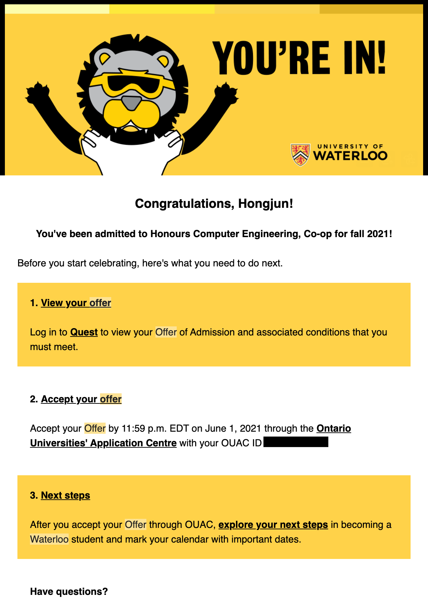
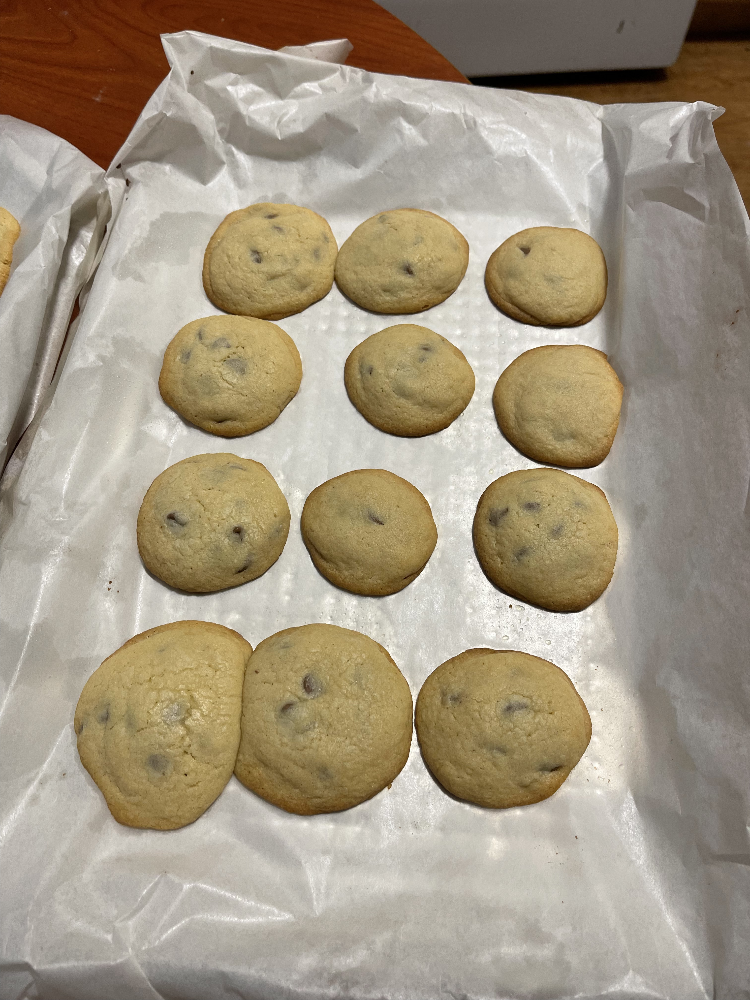

### Summary

- The realistic path to Waterloo Engineering offer
- A 12th-grade grade defense and the AIF portfolio that came together by coincidence
- Differences between the UW and UT video interviews (Kira Talent)
- The last day of May

Before the acceptance email arrived on the last day of May, Waterloo Engineering was just a stretch goal I never seriously thought I'd hit.

I came to Canada in July 2018 for Grade 11. Graduated in June 2021 after Grade 13. I had to take an extra year because I didn't have enough credits transferring in — which is pretty common for international students coming in mid-high school.
 
Three years in the Canadian high school system — and somehow, through a mix of luck and whatever effort I managed to put in, I ended up with an offer from Waterloo ECE.

This isn't a "do these five things and you'll get in" post. It's just an honest, personal record of what the process actually looked like for me. If you're an international student figuring out Canadian university admissions, or just curious about what Waterloo ECE takes — this might be useful. Or at least relatable.

---

## Part 1. Grades and Reality

### The Realistic Compromise

UW ECE wasn't some carefully planned goal from the start. My actual plan was to aim somewhere more realistic — McMaster or Alberta Engineering or Math — and just hit whatever grades they needed.

My 12th grade English (ENG4U) was always a concern. I'd started in ESL D back in Grade 11, and a 70-something in Grade 11 English wasn't exactly confidence-inspiring. Luckily, I was prepping for IELTS a bit earlier at the time, so I somehow managed to land in the mid-high 80s.

Grade 12 Physics was its own disaster. I dropped it the first time after a rough midterm, retook it with a stricter instructor, ground through lab reports and projects, and finished with a mid-80s.

The rest of my weak spots were covered by my stronger CS courses, which were sitting comfortably in the mid-to-high 90s.

My final Top 6 average landed in the low 90s.
 
Solid enough for McMaster.
 
For Waterloo ECE? Honestly, not the kind of number you'd bet on.

## Part 2. Extracurriculars and Real Experience

### Chasing Easy Credits: The Hacksmith Internship

With a safety school locked in (Mc and UAlberta), I wanted to coast through the rest of my applications.
The school co-op program seemed perfect — one placement, 2 credits, done.

Except no one wanted to hire me. Government offices didn't even read my resume after they found out I was international.
My co-op teacher ended up cold-emailing the owner of **The Hacksmith** — a well-known engineering YouTube channel — and somehow landed me an unpaid internship.

**The Timbit Deal**

The commute was the real problem. A 25-minute walk to the bus stop in the middle of a Canadian winter, or $30 each way by Uber. Neither was pleasant nor sustainable.

My IT supervisor came up with a solution: bring a **$4.99 pack of 20 Timbits** every morning, and he'd drive me home after work. I said yes immediately.

**AliExpress and Survival Coding**

While the rest of the team was building things for YouTube, I was building internal infrastructure — a Google Calendar-integrated smart E-ink nameplate and an internal network using ESP8266 modules and MQTT.

My coding background at the time was basic C and Java 1.8.
 
Everything else — Node.js, server integration — I figured out on the fly through Google.

The AliExpress parts were cheap for a reason. Half of them were defective. Something didn't work? Test it across multiple devices. Bad chip? Grab a new one from the drawer.

> **💡 My Thought** — I wasn't trying to build a portfolio. I was trying to get easy credits. But patching together a broken system with defective parts turned out to be exactly what admissions wanted to see.

### Volunteering Hours That Spiraled Into an AWS Bill

Canadian high schools require a set number of volunteer hours to graduate. Then COVID hit, and every in-person option disappeared overnight.

As a Grade 12 student, I was running out of time. So I pitched an idea to the director of a local Korean tutoring academy - the one that had helped me when I first arrived in Canada. The proposal was: I'd build them a student reward/penalty tracking website for their online classes.

What started as a casual side project turned into my first real encounter with AWS. I set up a Node.js and SQL server, but it couldn't handle even moderate traffic. It kept crashing, and at some point I started getting what looked like DOS attacks.

I spent way too much time keeping the server alive than expected. It never really worked reliably enough for long-term use. But that was fine — I got my volunteer hours.
 
More importantly, I had a story about debugging a server under pressure, which made for a much better AIF (Admission Information Form) essay than any project that actually worked.

### Coding Competitions: NYPC and CCC

I listed two main competition results on my AIF.

The first was **NYPC (Nexon Youth Programming Challenge)** — a Korean coding competition I had participated in before coming to Canada, where I placed in the Top 300.

The second was **CCC (Canadian Computing Competition)**, where I received a Distinction Award (top 25%). No special prep — just the coding sense I'd built up over time.

I also put down my math competition results: **Fermat, Hypatia, and Euclid**, each landing in the top 25%. Nothing groundbreaking, but solid enough to show I could handle the math side of an engineering program.

## Part 3. Application and Interviews

### The AIF: Quantum Computing and a Lucky Guess

For Waterloo's AIF (Admission Information Form), I wrote about **quantum computing** and referenced **Donna Strickland** — a Nobel Prize-winning physicist based at Waterloo.

My Grade 12 Physics report happened to be on quantum computing. While researching, I came across the fact that a Waterloo professor recently (at the time of application) had won the Nobel Prize in Physics for related work. I wove that into my essay — read some of her papers (understood maybe 10% of them at the most), ran a demo on IBM's quantum computer, and built my argument around that.

In hindsight, there was a glaring gap in my process. I dug through academic papers for my essay, but I never once looked at Waterloo's official "what we look for in applicants" page. I didn't even know it existed until well after I enrolled. Looking back, I have no idea how I got in. I just scribbled whatever I wanted them to see in my essay.

> Check the official admissions criteria before you write a single word of your AIF. I didn't. Don't be me.

### The Friend Who Fixed My Essay

One thing that genuinely helped was feedback from a close friend who was going through admissions at the same time. The comment she left at the end of my AIF draft is still there:

_"overall feedback: 열심히 잘 쓰셨네요 조금씩의 디테일... 항상 느낀 점 배운 점 그런 걸 명시하는 게 중요... 굿나잇!"_

> "overall feedback: You did a good job overall, just a few details here and there... always make sure to spell out what you felt and learned... good night!"

She was busy with her own applications, but she took the time to point out what actually mattered — not just listing experiences, but showing what you learned from them. That note changed how I rewrote the whole thing.

### The Kira Talent Interview: UofT vs UWaterloo

Both the University of Waterloo and UToronto used **Kira Talent** for their video interviews — but they couldn't be more different.

UofT threw logic and calculation problems at me. One of them was something like: _"How would you calculate the fuel consumption difference between an empty truck and a loaded one traveling a set distance?"_ On the spot. Timed. No pressure.

Waterloo's interview was entirely verbal — no typed questions, no math. Just things like _"What do you want to do after graduating from Waterloo?"_ Standard vision questions.

There's a personal detail I'll include here. I was in Grade 13, which meant I was **legally** allowed to drink. The pressure of recording myself answering questions in English alone in my room got to me, so I had <small>~~a Corona before hitting record~~</small>. If Waterloo had thrown a UofT-style calculation problem at me, I would have been done. Fortunately, the questions were straightforward enough that a little liquid courage got me through.

## Part 4. Results

### May, Ten Minutes Apart

By March, I already had offers from McMaster, Western, (some)Toronto, and Alberta applications.

Waterloo was the last one. No word until the very end of May.

At 4:40 PM on the last day, a **Waterloo Computer Science** rejection email arrived. I figured that was it — if CS was a no, CE was probably gone too. I closed my laptop and lay down.

At that point I was planning my journey to Hamilton. I was already looking at residences for first year down south.

Ten minutes later, right at 4:50 PM, a **Waterloo Computer Engineering** acceptance email arrived.

I spent the next ten minutes jumping on my bed. Then I ran to my roommates' rooms to tell them. They'd already committed to their schools, so they had no idea why I was losing my mind. I called my parents in Korea later that night — the time difference made it too early to call right away.

Waterloo's tuition was significantly higher than McMaster's. I hesitated for a second or maybe two. My mom said: _"Study whatever you want to study."_ That was the end of the hesitation.

### Post Offer Acceptance and towards graduation

The rest of high school was quiet. I joined a few Zoom orientation sessions for incoming Waterloo students, and started sorting my stuff into two piles — things going to Korea, things to be left at my friends' place at Waterloo.

My roommates and I often went to Tim Hortons for Lemonade Chills, took walks, and baked cookies at home. Nothing dramatic. Just the tail end of something.

|  |  |
| :---------------------------------: | :------------------------------: |

Looking back, nothing about my path to Waterloo was carefully planned. A shaky grade average, an accidental portfolio, a physics report that happened to mention a Nobel laureate at the right school. It all somehow added up.

> Anything you do towards your dream will definitely help you someday.

Next up: the real Waterloo experience starts — **Co-op.**

  
📌 (Reference) Grade 12 Required Courses and Conditions for Waterloo Engineering

  

    <ul class="list-disc pl-5 space-y-2">
      <li><strong>Required courses:</strong> Grade 12 English (ENG4U), Advanced Functions (MHF4U), Calculus (MCV4U), Chemistry (SCH4U), Physics (SPH4U)</li>
      <li><strong>English proficiency (IELTS):</strong> Meeting the overall band score isn't enough. There are minimum scores per section — <strong>Writing 6.5, Speaking 6.5, Reading 6.0, Listening 6.0</strong>. Missing even one will cost you the offer. Always verify with the official admissions page at the time of application.</li>
      <li><strong>Video interview (Kira Talent):</strong> Expect vision and motivation questions — why Waterloo, what kind of engineer you want to be, how you've handled conflict in a team. Less math, more personality.</li>
    </ul>
  

---

