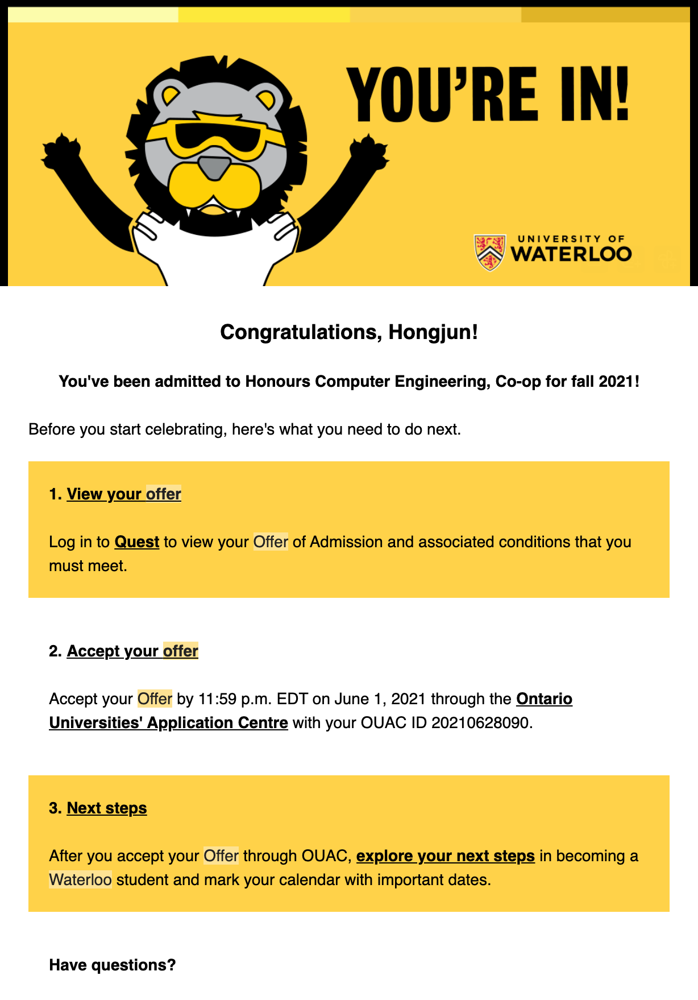

### Summary

- 캐나다 유학 3년 만에 워털루 공대에 합격할 수 있었던 현실적인 과정
- 12학년 성적 방어전과 우연이 겹쳐 만들어진 AIF 포트폴리오
- 토론토 대학교와 워털루 대학교의 비디오 인터뷰(Kira Talent) 차이
- 5월의 마지막 날, 10분 간격으로 희비가 엇갈린 합격 오퍼

>이 글을 음성으로 듣고 싶다면 아래 플레이어를 이용하세요.

  

    Post 04
    
  

  

    <audio id="article-audio" src="/audio/blog04-how-i-got-into-waterloo-kr.mp3" preload="metadata"></audio>
    

      <svg id="play-icon" xmlns="http://www.w3.org/2000/svg" viewBox="0 0 24 24" fill="currentColor" class="w-7 h-7 ml-1"><path fill-rule="evenodd" d="M4.5 5.653c0-1.426 1.529-2.33 2.779-1.643l11.54 6.348c1.295.712 1.295 2.573 0 3.285L7.28 19.991c-1.25.687-2.779-.217-2.779-1.643V5.653z" clip-rule="evenodd" /></svg>
      <svg id="pause-icon" xmlns="http://www.w3.org/2000/svg" viewBox="0 0 24 24" fill="currentColor" class="w-7 h-7 hidden"><path fill-rule="evenodd" d="M6.75 5.25a.75.75 0 01.75-.75H9a.75.75 0 01.75.75v13.5a.75.75 0 01-.75.75H7.5a.75.75 0 01-.75-.75V5.25zm7.5 0A.75.75 0 0115 4.5h1.5a.75.75 0 01.75.75v13.5a.75.75 0 01-.75.75H15a.75.75 0 01-.75-.75V5.25z" clip-rule="evenodd" /></svg>
    

    

      
음성으로 이 글 듣기

      
Premium AI Voice (Han)

    

    

      

      

      

      

    

  

제가 캐나다에 처음 온 것이 2018년 7월(11학년), 그리고 고등학교를 졸업한 게 2021년 6월입니다(13학년). 딱 3년 동안 캐나다 고등학교 시스템에 적응하면서 운과 노력이 겹쳐 워털루 대학교 공대에 합격할 수 있었습니다.

이 글은 이제 막 유학길에 올랐거나, 워털루 공대 입시의 현실적인 과정이 궁금하신 분들을 위해 남기는 지극히 개인적인 기록입니다. 누군가에게는 참고가 되기를 바랍니다. 제가 나온 고등학교는 온타리오주 키치너에 소재한 고등학교이니, 이 점 유의하시기 바랍니다.

---

## Part 1. 학업과 현실

### 현실적인 타협: 저조한 성적
워털루 공대는 처음부터 준비했던 목표가 아니었습니다. 제 현실적인 플랜은 아무것도 없었고, 맥마스터(McMaster)나 알버타(Alberta) 대학교 공대를 막연한 목표로만 가지고 있었습니다. 그리고 그곳에서 요구하는 커트라인 정도만 적당히 채우자는 생각이었습니다.

10학년 때 ESL로 시작해 11학년 첫 영어 성적에서 70점대를 받았던 터라 12학년 영어(ENG4U)는 늘 부담이었습니다. 다행히 공인영어(IELTS)를 준비하던 시기와 겹쳐 80점대 후반으로 간신히 넘겼습니다. 12학년 물리는 첫 수강 때 미드텀 점수가 낮게 나와서 바로 드랍(Drop)했고, 재수강 때 깐깐한 선생님을 만나 랩 리포트와 프로젝트를 제출하며 80점대 중반으로 마무리했습니다. 나머지 부족한 점수는 평소 자신 있던 컴퓨터 과목들(90점대 중후반)로 채웠습니다.

결과적으로 12학년 6개 과목(Top 6) 최종 평균은 90점대 초반이었습니다. 맥마스터를 가기에는 안정적이었지만, 워털루 ECE 기준으로는 합격을 전혀 기대하기 힘든 평범한 상향 지원 점수였습니다.

## Part 2. 비교과와 실전 경험

### 2학점짜리 꿀 강의를 찾아서: 'The Hacksmith' 인턴십
안전한 목표가 생겼다고 생각하니 남는 입시는 자기소개서에 집중하고 편하게 보내고 싶어졌습니다. 그래서 선택한 것이 학교 Co-op(인턴십) 프로그램이었습니다. 코업은 한 번 이수하면 2학점을 인정해 주기 때문에, 학교 밖에서 편하게 학점을 채워보겠다는 심산이었습니다.

하지만 편하게 시간을 때우려던 계획은 시청 같은 기관들에서 면접 연락조차 오지 않으며 어긋났습니다. 보다 못한 코업 담당 선생님이 같은 고등학교 출신인 유명 공학 유튜브 채널 'The Hacksmith' 사장님께 연락해 면접 자리를 잡아주셨고, 그렇게 무급 인턴으로 출근하게 되었습니다.

**상사의 제안: 매일 팀빗 20개짜리 카풀**
문제는 거리였습니다. 한겨울에 버스 정류장까지 25분을 걸어야 했고 우버를 타면 편도 30불이 깨졌습니다. 감당이 안 되던 찰나, IT팀 상사분이 먼저 거래를 제안하셨습니다. **"매일 아침 출근길에 4.99불짜리 팀빗(Timbit) 20개 팩을 사 오면 퇴근길 카풀을 해주겠다"**는 조건이었고, 저는 당연히 수락했습니다.

**알리익스프레스와 생존형 코딩**
저는 유튜브에 나오는 멋진 작업 대신, 사내 인프라를 구축하는 일을 맡았습니다. 구글 캘린더를 연동한 스마트 E-ink 명패, ESP8266 모듈과 MQTT를 활용한 사내망 구축이었습니다.
당시 제 코딩 실력은 C언어 기초와 Java 1.8이 전부라 사내 서버용 Node.js 연동 등은 구글링으로 그때그때 땜질했습니다. 비용 절감을 위해 알리익스프레스에서 산 부품들은 불량이 넘쳐났습니다. 하지만 대단한 성취감 같은 건 없었습니다. 그냥 일이니까 어떻게든 굴러가게 만드는 게 목적이었죠. 안 되면 여러 기기에 테스트해 보고, 제 코드가 문제면 고치고, 칩 자체 불량이면 그냥 서랍에서 새 8266 칩을 꺼내 썼습니다. 어차피 엄청 쌌으니까요.
편하게 2학점을 따려다 불량 부품과 싸우며 땜질식으로 시스템을 엮어냈는데, 훗날 입학 사정관들에게는 이 고생담이 진짜 하드웨어와 소프트웨어를 다뤄본 의미 있는 실무 포트폴리오로 작용한 것 같습니다.

### 봉사 시간을 채우려다 맞은 서버 트래픽 과금
캐나다 고등학교는 졸업을 위해 무조건 봉사 시간을 채워야 합니다. 그런데 12학년 때 코로나가 터지면서 오프라인 봉사활동이 다 막혔습니다. 시간이 급했던 저는, 유학 초기에 여러모로 도움을 받았던 동네 유학원(TEMS Academy) 원장님께 혹시 도울 일이 없는지 물었습니다.

마침 비대면 수업 때문에 학생들 상벌점을 구글 독스로 관리할 계획이라고 하시길래, 제가 전용 포인트 시스템 웹사이트를 만들어드리겠다고 역제안했습니다.
그렇게 가벼운 마음으로 시작한 1인 개발은 제 인생 첫 AWS(Amazon Web Services) 입문기가 되었습니다. Node.js와 SQL을 연동해 서버를 올렸는데, 트래픽이 조금만 몰려도 서버가 다운되고 DOS 공격 비슷한 비정상적인 접근까지 들어왔습니다.

에러를 막고 서버를 살려내느라 진땀을 뺐고, 잦은 오류 탓에 학원에서 시스템을 길게 실사용하지는 못했습니다. 하지만 오히려 운이 좋았습니다. 필요한 봉사 시간(36.5시간)을 채운 것은 물론이고, AWS 서버가 터지고 그걸 수습해 본 경험 자체가 AIF 에세이에 쓸 수 있는 훌륭한 문제해결 소재가 되어주었기 때문입니다.

### 코딩 경시대회: NYPC와 CCC
저는 AIF에 두 가지 주요 코딩 대회 실적을 기재했습니다. 한국에서 참가했던 넥슨 청소년 프로그래밍 대회(NYPC) Top 300, 그리고 캐나다에서 치른 캐나다 컴퓨팅 대회(CCC) Distinction Award(상위 25%)입니다.

대회를 위해 거창한 대비를 하지는 않았습니다. 한국에서 NYPC에 참가할 당시에는 '백준(Baekjoon)' 사이트에서 알고리즘 문제를 조금 풀어본 것이 전부였고, 12학년 때 치른 CCC는 따로 준비를 하지 않고 시험을 봤습니다.
두 대회는 포맷에서 뚜렷한 차이가 있었습니다. NYPC는 문제를 해결하는 데 일(day) 단위의 긴 시간이 주어지는 방식이었고, 워털루에서 주관하는 CCC는 약 2시간 동안 5문제를 빠르게 풀어내야 했습니다.

평소 코딩을 해오던 감각을 바탕으로 시험을 치렀고, 결과적으로 상위 25% 이내의 성적인 Distinction을 받았습니다. 수학 경시대회인 Fermat, Hypatia 그리고 Euclid에서도 각각 Distinction을 받아 수학적 기초를 증명하는 지표로 활용했습니다.

## Part 3. 원서와 면접

### AIF 에세이: 양자 컴퓨터와 치밀한 헛발질
워털루 대학교 입시의 핵심인 AIF(Admission Information Form) 지원 동기 에세이에는 '양자 컴퓨터(Quantum Computing)'와 노벨 물리학상 수상자인 도나 스트릭랜드(Donna Strickland) 교수님을 언급했습니다.

12학년 물리 수업 당시 제가 맡았던 보고서 주제가 양자 컴퓨터였고, 자료를 조사하던 중 마침 워털루 소속 교수님이 관련 연구로 노벨상을 받았다는 사실을 알게 되어 이를 에세이 소재로 엮은 것입니다. 12학년 물리 발표 및 보고서 준비를 위해 교수님의 논문을 찾아보고(당연히 거의 이해하지 못했습니다), IBM 양자 컴퓨터 데모 버전까지 다뤄보며 앞으로 이 분야에 어떤 기술이 필요할지 나름의 생각을 에세이에 녹여냈습니다. 딱히 대학 지원을 위해 읽었던 발표 자료가 아닌데, 의외의 것들이 저의 지원을 많이 도와줬습니다.

하지만 돌이켜보면 헛발질도 있었습니다. 이렇게 논문까지 뒤져가며 에세이를 썼으면서, 정작 대학 홈페이지에 명시된 공식적인 '워털루가 바라는 인재상' 페이지는 단 한 번도 읽어보지 않았다는 점입니다. 그런 가이드라인이 존재한다는 사실조차 입학 후 한참이 지난, 휴학 직전에야 알았습니다.

### 마지막 디테일을 채워준 동료의 피드백
AIF 에세이 완성에는 함께 대학 입시를 준비하던 친한 동생의 피드백이 큰 역할을 했습니다. 제 AIF 초안 문서 마지막에는 당시 그 친구가 남긴 코멘트가 아직도 남아있습니다.
*"overall feedback: 열심히 잘 쓰셨네요 조금씩의 디테일... 항상 느낀 점 배운 점 그런 걸 명시하는 게 중요... 굿나잇!"*

본인의 입시로 바쁜 와중에도 제 글을 읽고 객관적인 시선으로 핵심을 짚어준 덕분에, 저는 단순한 경험 나열을 넘어 '무엇을 배웠는지'에 집중하는 글로 에세이를 다듬을 수 있었습니다. 혼자 썼다면 놓쳤을 중요한 디테일을 채울 수 있었던 고마운 순간이었습니다.

### ECE 캐나다 면접 후기 (Kira Talent): 토론토의 트럭과 워털루의...
입시의 마지막 관문은 비디오 인터뷰(Kira Talent)였습니다. 저는 토론토 대학교와 워털루 대학교 인터뷰를 모두 치렀는데, 두 학교의 질문 스타일은 확연히 달랐습니다.

토론토 대학교는 "빈 트럭과 짐을 적재한 트럭의 특정 거리 이동 시 소모되는 연료량을 어떻게 계산할 것인가?" 같은 즉석 논리/계산 문제를 던졌습니다. 반면 워털루 대학교는 짧은 타이핑 문항 없이, "워털루를 졸업하면 무엇을 하고 싶은가?" 등 전형적인 목표와 비전을 묻는 구두 질문들로만 구성되어 있었습니다.

사실 제 워털루 인터뷰에는 개인적인 비하인드가 있습니다. 당시 저는 13학년(재학 연장)이었고 합법적으로 술을 마실 수 있는 성인이었습니다. 카메라 앞에서 혼자 영어로 대답해야 한다는 압박감에, 인터뷰 직전 긴장을 풀겠다며 <small>~~코로나(Corona) 맥주를 한 병~~</small> 마셨습니다. 
만약 워털루에서 토론토처럼 계산식을 세워야 하는 문제가 나왔다면 아찔했겠지만, 다행히 질문들이 평이했던 덕분에 약간의 용기<small>(~~알코올 기운~~)</small>을 빌려 덤덤하게 대답을 녹화할 수 있었습니다.

## Part 4. 결과와 그 이후

### 5월, 희비가 엇갈린 10분
입시 결과가 나오는 시즌, 저는 이미 3월에 맥마스터, 웨스턴, 토론토, 알버타 대학교 등에서 합격 오퍼를 받아둔 상태였습니다.

하지만 가장 원하던 워털루 대학교의 결과는 마지막 라운드의 마지막 날인 5월 마지막 발표 날까지도 감감무소식이었습니다. 피 말리는 기다림 끝에 오후 4시 40분, 워털루 컴퓨터 사이언스(CS) 불합격(Decline) 이메일이 먼저 도착했습니다.

그 메일을 본 순간 '결국 컴퓨터 공학(CE)도 떨어졌겠구나' 체념하고 침대에 누웠습니다. 머릿속에는 당장 눈앞의 현실적인 고민들이 스쳐 지나갔습니다.
> *"아, 맥마스터 가면 해밀턴에서 뭐 하지? 거긴 아무것도 없던데. 아는 선배한테 연락해 볼까? 당장 기숙사부터 알아봐야 하나?"*

그런데 불과 10분 뒤인 오후 4시 50분, 워털루 컴퓨터 공학(CE) 합격 오퍼 이메일이 도착했습니다.

결과를 확인하자마자 저는 침대 위에서 10분 정도를 방방 뛰었고, 갈 대학이 이미 다 정해져 있던 룸메이트들 방으로 뛰어가 이 소식을 전했습니다. 시차 때문에 한국에 계신 부모님께는 밤이 되어서야 소식을 알렸습니다. 맥마스터보다 워털루의 학비가 훨씬 비싸서 잠시 고민했지만, 어머니께서 "네가 하고 싶은 공부는 다 하라"고 지지해 주신 덕분에 미련 없이 워털루 ECE 진학을 최종 결정했습니다.

### 합격 그 이후부터 6월 졸업까지
5월이 되어서야 입시가 완전히 끝났지만, 그렇다고 고등학교 생활이 끝난 것은 아니었습니다. 졸업 때까지 유지해야 하는 조건부 성적 기준이 남아 있었기 때문에 마냥 손을 놓을 수는 없었습니다. 

아버지는 합격 선물로 새 휴대폰과 스마트워치를 사주셨습니다. 저는 값비싼 학비를 납부할 준비를 시작했고, 대학에서 주최하는 신입생 줌(Zoom) 세미나에도 참여하며 다가올 워털루 생활을 차근차근 대비했습니다. 졸업이 다가오면서 이사 준비도 겹쳤습니다. 거처를 옮겨야 했기에 잠시 돌아갈 한국행 짐과 가을 학기부터 지낼 워털루행 짐을 따로 분류해 정리해야 했습니다.

같이 살던 룸메이트들도 각자 다른 대학으로 진학하게 되면서 곧 뿔뿔이 흩어질 예정이었습니다. 남은 시간 동안 우리는 거창한 이벤트 대신 팀홀튼에 가서 레모네이드 칠(Lemonade Chill)을 마시거나 공차를 마시며 동네를 산책하고, 맥도날드에 들르거나 집에서 함께 쿠키를 구워 먹는 등 소소하고 평범한 일상을 보냈습니다.

|  |  |
|:---:|:---:|

돌이켜보면 3년이라는 짧은 유학 기간 동안 모든 것이 치밀한 계획대로만 흘러가지는 않았습니다. 성적 유지를 위한 노력, 알리익스프레스 불량 칩과의 씨름 그리고 우연히 맞물린 포트폴리오까지. 이 투박하고 현실적인 과정들이 어떻게든 모여 합격이라는 결과를 만들었습니다. 다음 글에서는 워털루의 상징, 'Co-op(코업)' 구직의 지독한 현실을 어떻게 뚫어냈는지 생생한 1학년 생존기로 이어집니다.

---

