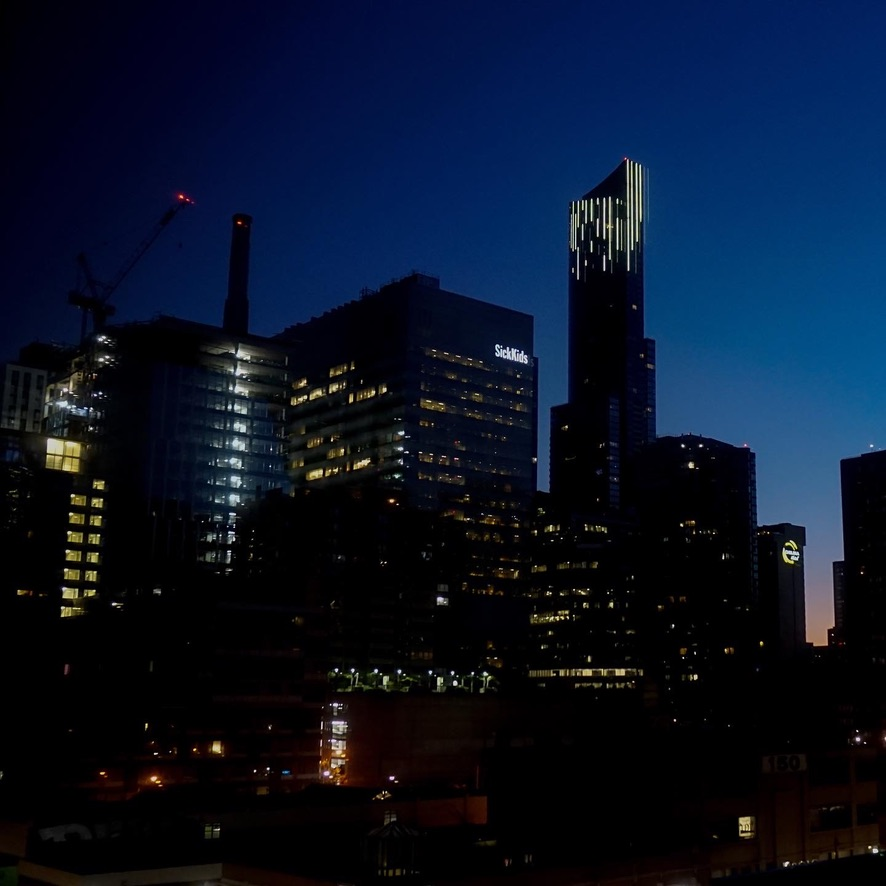
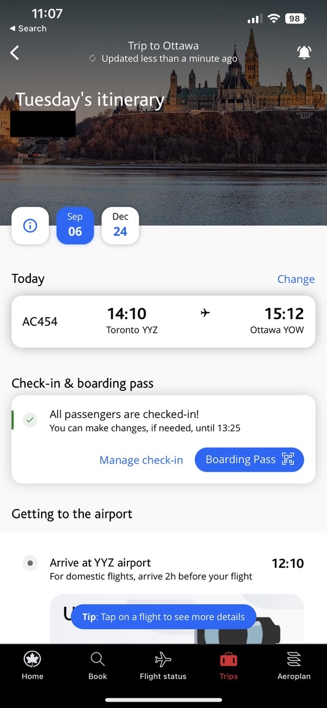
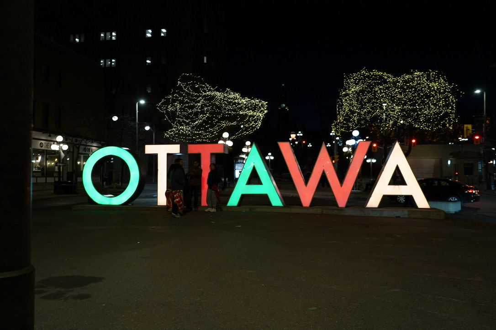

### Summary

- 워털루 코업 apply 시스템 WaterlooWorks — Cycle 1, 2, Continuous까지
- PR 없어서 바로 끝나고, 운전면허 때문에 떨어진 코업
- 코로나 시대 오타와 재택근무와 밥
- 크리스마스 이브, 블리자드 속에서 마무리된 4개월

> 이 글을 음성으로 듣고 싶다면 아래 플레이어를 이용하세요.

  

    Post 05
    
  

  

    <audio id="article-audio" src="/audio/blog05-coop2-ottawa-kr.mp3" preload="metadata"></audio>
    

      <svg id="play-icon" xmlns="http://www.w3.org/2000/svg" viewBox="0 0 24 24" fill="currentColor" class="w-7 h-7 ml-1"><path fill-rule="evenodd" d="M4.5 5.653c0-1.426 1.529-2.33 2.779-1.643l11.54 6.348c1.295.712 1.295 2.573 0 3.285L7.28 19.991c-1.25.687-2.779-.217-2.779-1.643V5.653z" clip-rule="evenodd" /></svg>
      <svg id="pause-icon" xmlns="http://www.w3.org/2000/svg" viewBox="0 0 24 24" fill="currentColor" class="w-7 h-7 hidden"><path fill-rule="evenodd" d="M6.75 5.25a.75.75 0 01.75-.75H9a.75.75 0 01.75.75v13.5a.75.75 0 01-.75.75H7.5a.75.75 0 01-.75-.75V5.25zm7.5 0A.75.75 0 0115 4.5h1.5a.75.75 0 01.75.75v13.5a.75.75 0 01-.75.75H15a.75.75 0 01-.75-.75V5.25z" clip-rule="evenodd" /></svg>
    

    

      
음성으로 이 글 듣기

      
Premium AI Voice (Han)

    

    

      

      

      

      

    

  

200개 가까운 지원서를 넣고, 전화 한 통으로 오타와행이 결정됐습니다.

---

## Part 1. 다시 캐나다로

### 9월 5일, 인천발 토론토행

2022년 9월 5일 아침 7시, 인천공항 위탁수하물 카운터 앞이었습니다.
 
대한항공 KE073편, 39A 창가 자리. 수하물 2개를 다 부치고 나서야 슬슬 워털루로 가는게 아님을 실감했습니다.

15시간을 날아 토론토에 도착했습니다. 그때는 이렇게 길어질줄 몰랐던 우크라이나-러시아 전쟁 때문에 예정보다 더 걸렸습니다.

Baggage Claim을 지나, immigration도 지나, 다운타운 호텔 방에 짐을 풀었는데, 창밖으로 보이는 야경은 꽤 괜찮았습니다. 나름 힐튼 브랜드였거든요.

한국 가기 전에 토론토에 사는 유학 후배한테 맡겨뒀던 오타와행 캐리어를 받아들고, 호텔방으로 향했습니다.

창문 밖으로 보이는 SickKids 빌딩, 하지만 그걸 제대로 볼 여유가 없었습니다. 한국에서 싸온 짐이랑 오타와에서 쓸 짐이 뒤섞인 캐리어들을 다시 분류해야 했거든요.

수하물 허용은 3개인데 캐리어는 4개. 결국 작은 캐리어를 큰 캐리어 안에 통째로 집어넣었습니다. 나름 깔끔한 해결이었습니다. 
밤 늦게 잠에 들었습니다.

다음날 아침 9시, 호텔 조식을 먹고 공항으로 다시 향했습니다. 오후 2시 10분, AC454편. 목적지 오타와.

## Part 2. WaterlooWorks, 200개의 지원서

### 전화 한 통

워털루 코업 구직 시스템인 WaterlooWorks는 Cycle 단위로 돌아갑니다. Cycle 1, Cycle 2, 그리고 그 이후에도 매칭이 안 되면 Continuous로 넘어갑니다.

Continuous 전까지는 사이클마다 지원할 수 있는 포스팅이 최대 50개로 제한되어 있고, Continuous부터는 그 제한이 풀립니다.

저는 Cycle 1에서 50개, Cycle 2에서 50개, Continuous에서 100개 가까이 넣었습니다. 합쳐서 200개 가까운 지원서였습니다.

Cycle 1에서 면접은 두 개였습니다. OpenText는 PR이 없다고 하자마자 분위기가 싸늘해졌고, 그걸로 끝이었습니다. 또 다른 하나는 항공사 웹사이트를 만드는 코업이었는데, 면접 중에 Full G Driver's Licence가 필수 조건이라는 걸 알게 됐습니다. 캐나다 운전면허가 없던 국제 학생 신분으로는 어쩔수가 없었습니다.

Cycle 2는 조용히 지나갔습니다. 그리고 Continuous로 넘어가고 얼마 지나지 않아 연락이 왔습니다. Zoom도, 대면도 아닌 전화 면접이었습니다. 그게 Huawei였습니다.

## Part 3. 오타와 정착

### 오타와에서의 하루

재택근무는 단순했습니다. 오전에 회의 들어가고, 방대한 코드베이스를 파악하고, 구현할 부분을 마저 작성하고. 점심을 먹고 다시 일하고, 퇴근. 코로나 시기라 오피스에 나갈 일도 거의 없었습니다.

퇴근 후에는 같은 건물에 살던 SFU 출신 인턴이랑 헬스장에 갔습니다. 집에 돌아와서 프로틴 마시고 샤워하고 저녁을 먹는 것으로 하루가 끝났습니다.

주말에는 카메라를 들고 오타와 시내로 나가거나, 가끔 토론토까지 다녀오기도 했습니다. 집에 있는 날에는 사진을 정리하거나 브이로그를 편집했습니다.

<iframe
  width="100%"
  style="aspect-ratio: 16/9;"
  src="https://www.youtube.com/embed/KxamKzehj2w"
  title="브이로그 중 하나"
  frameborder="0"
  allowfullscreen
></iframe>

요리는 생각보다 진지하게 했습니다. 멀티쿠커를 하나 사서 밥을 하고 딸려있는 주방에서 요리를 매일 했습니다. 메뉴는 된장찌개, 크림 파스타, 오일 파스타를 돌아가며 해먹는 게 기본 루틴이었고, 거기서 점점 욕심이 생겼습니다.

T&T에서 생새우를 배달시켜 새우장을 담갔습니다. Costco 생물연어로는 연어장을 만들었습니다. 둘 다 간장에 레몬과 꿀을 넣고 끓인 베이스를 부어서 숙성시키는 방식이었습니다. 생각보다 어렵지 않았고, 밥 위에 올려 먹으면 그냥 한식 밥상이 됐습니다.

가장 공이 많이 들어간 건 꼬리곰탕이었습니다. T&T에서 소꼬리뼈를 배달시켜 솥에 넣고 끓이기 시작했는데, 레시피에 12시간 이상 약한불에 끓이라고 나와 있었습니다. 결국 밤새 지켜보면서 끓였습니다. 다음 날 아침 뚜껑을 열었을 때 나오는 뽀얀 국물은, 그 수고가 아깝지 않았습니다.

물리기 쉬운 차 대신 레몬 청도 만들었습니다. 생각보다 많이 나왔습니다. 큰 jar 두 개, 작은 jar 하나 분량이었습니다.

혼자 사는 오타와 자취방치고는 나름 알차게 먹고 살았습니다.

> 어차피 다 먹고살자고 하는 일인데 지금 못먹는게 말이 안된다고 생각했거든요.

### 오타와 구석구석

주말에는 카메라를 들고 나갔습니다. 자주 간 곳은 Parliament Hill이었습니다.
 
딱히 목적이 있는 건 아니었고, 그냥 걷거나 사진을 찍다 돌아오는 게 전부였습니다.

오타와는 조용한 도시였고, 그 조용함이 나쁘지 않았습니다.

필름 카메라로 찍은 사진들은 Aberdeen Plaza에 있는 GPC Labworks에서 현상했습니다.
 
토론토보다 가격이 싸서 필름 샀습니다. 필름 현상을 기다리는 소소한 루틴이 생겼습니다.

National Gallery of Canada도 다녀왔습니다. 현대미술 섹션이 생각보다 인상적이었습니다. 미술에 특별히 조예가 있는 건 아니었지만, 작품들 앞에서 한참 서 있게 됐습니다.

12월이 되자 Aberdeen Plaza에 크리스마스 마켓이 열렸습니다. 코로나 시기라 규모가 크지는 않았지만, 오타와에서 보내는 처음이자 마지막 크리스마스 시즌이었습니다.

## Part 4. 크리스마스 이브, 오타와를 떠나며

### 3시간 지연, 그리고 끝

2022년 12월 24일, 오후 4시 출발 예정이었습니다.

오타와-토론토 다운타운 구간은 작은 비행기라 수하물 제한이 빡빡했습니다. 미리 Via Rail로 짐을 키치너로 옮겨뒀고, 몸만 비행기를 타면 됐습니다.
하필 그날 오타와에는 블리자드가 왔습니다. 활주로는 눈으로 덮여 있었고, 비행기는 출발 전 de-icing 작업을 받아야 했습니다. 창밖으로 노란 de-icing 차량이 날개 위에 액체를 뿌리는 걸 바라보며 기다렸습니다.

결국 비행기는 오후 7시 10분에 떴습니다. 3시간 넘게 지연이었습니다.

워털루에 도착한 건 밤 11시였습니다. 우버를 타고 Rez-One Elora House로 향했습니다. 크리스마스 이브 자정이 다 된 시각이었습니다.

4개월이었습니다. 9월에 짐 4개를 들고 왔고, 12월 크리스마스 이브 눈보라 속에서 떠났습니다. 거창한 마무리는 아니었지만, 오타와라는 도시가 그런 곳이었습니다. 조용히 시작해서 조용히 끝나는.

다음 글은 **2A 학기**입니다.

  
📌 (참고) WaterlooWorks 코업 apply 실전 팁

  

    <ul class="list-disc pl-5 space-y-2">
      <li><strong>지원 횟수 제한:</strong> Continuous 전까지는 사이클마다 최대 50개까지만 지원할 수 있습니다. 빅테크에만 몰아넣다가 횟수를 다 날리는 실수를 하지 마세요.</li>
      <li><strong>PR/시민권 조건은 직접 확인:</strong> WaterlooWorks 필터를 믿지 말고, 포스팅 본문을 Cmd+F로 직접 스캔하세요. PR, Citizen, SWPP 같은 키워드가 있으면 유학생은 지원해도 의미가 없는 경우가 많습니다.</li>
      <li><strong>면접 형식은 다양합니다:</strong> Zoom이나 대면 면접만 있는 게 아닙니다. 전화 면접으로만 진행되는 경우도 있으니 모든 연락에 빠르게 응답하는 습관을 들이세요.</li>
      <li><strong>Continuous를 두려워하지 마세요:</strong> Continuous까지 갔다고 끝난 게 아닙니다. 제한이 풀리는 만큼 오히려 더 넓게 지원할 수 있습니다. 물론 빅테크는 거의 없어요.</li>
    </ul>
  

---

