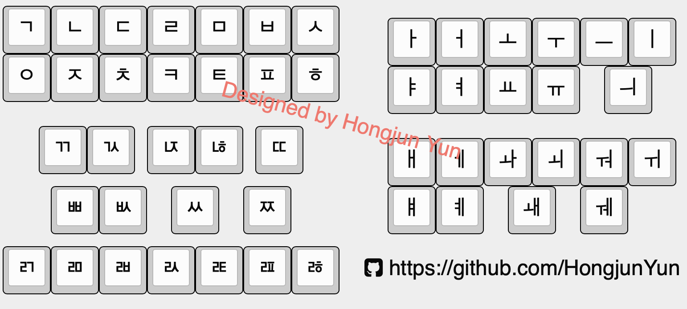

### Summary

- 대체 대화기기 개발 — 1

---

### 서문

우리가 일상적으로 사용하는 도구 중 가장 중요한 것 3개를 꼽으라고 하면, 휴대폰이나 컴퓨터를 언급하지 않는 사람은 아마 없을 것이다. 두 가지 다 큰 의미의 컴퓨터라고 볼 수 있다. 컴퓨터가 대중화되기 전 비슷한 역할을 수행한 것들로는 책, 신문, 타자기, 노트, 전신 정도일 것이다.

이들은 한 가지 커다란 전제 속에 들어있다. 사용자, 그리고 생산자가 서면언어로써 소통을 한다. 현대를 사는 현대인으로서 상상도 할 수 없는 일이지만 우리 조부모 세대에서는 글을 읽고 쓰는 걸 배우는 그 자체가 특권이었다. 자연히 책, 타자기, 신문 이런 매체도 글을 읽을 줄 아는 소수에게만 보급되었다.

해당 시기의 우리 선조들은 말을 선천적으로 못하거나 후천적으로 못하게 되는 사람들과는 글을 쓸 줄 아는 양반, 선비는 필담을 했고, 평민들은 독순술에 의지했다. 현대에서도 크게 다르지 않다. 특히 글은 쓸 수 있지만 노화, 근육, 관절, 신경적 이유 등 손으로 글씨를 쓸 수 없는 사람들은 독순술에 의지한다.

물론 말로 대화가 가능하면 문제가 없지만 그렇지 않은 경우도 적지만 분명히 존재한다. 입모양을 읽어서 의사표현을 하는 일은 화자와 청자 둘 다 상당히 힘든 일이다. 같은 단어를 맞게 알아들을 때까지 여러 번 말하고, 유추하는 과정이 매일 반복된다. 사투리라도 사용한다면 어떨지는 굳이 말하지 않아도 알 수 있을 것이다. 이 부분을 해소할 수 있는 기법에 대해 프로젝트를 진행해보려고 한다.

## 1. 프로젝트의 시작

### 사용자 분석

서문에서도 언급한 것처럼 이 프로젝트는 매우 좁은 사용자층을 가진다.

1. 한글을 쓰거나 타이핑할 수 있을 것
2. 손으로 글씨를 쓸 수 없거나 의미를 전달하기 힘들 것
3. 발화가 힘들 것

이 세 가지 조건을 모두 충족하는 사람을 타겟으로 한다. 또한 이와 같거나 유사한 사유로 독순술에 피로감이 있는 보호자도 넓은 의미의 사용자층이라고 확장할 수 있다.

### 문제 분석

프로젝트를 시작하기 전, 비슷한 목표나 비전을 가진 기기가 없는지 확인한다. 우선 해당 사항을 고려하여 출시된 제품이라면 한글 키보드, 어르신 키보드, 손떨림 키보드, 독수리 키보드 등의 대체 입력기기 검색에 떴어야 한다. 하지만 해당 내용으로는 글씨가 크게 써있는 쿼티 키보드만이 존재했다.

> **해당 키보드가 아직 시장에 존재하지 않는다면, 이에 대해 연구하고 있을 것**

이라는 생각이 들어 논문을 찾아보았다. 대표적으로 [[컴퓨터 키보드의 한글배열연구]](https://www.korean.go.kr/front/reportData/reportDataView.do?mn_id=207&searchOrder=years&report_seq=391&pageIndex=1), [[손가락 피로도를 고려한 유전 알고리즘 기반 한글 두벌식 키보드의 자판 배열 최적화]](https://www.kci.go.kr/kciportal/ci/sereArticleSearch/ciSereArtiView.kci?sereArticleSearchBean.artiId=ART003095694), [[사용빈도와 표준정합성을 고려한 컴퓨터 한글자판의 개선에 관한 연구]](https://scienceon.kisti.re.kr/srch/selectPORSrchArticle.do?cn=JAKO200816049040476), [[근육장애인을 위한 맞춤형 대체키보드 개발 및 평가]](https://www.dbpia.co.kr/journal/detail?nodeId=T16943473) 등 여러 논문을 이해하려고 노력하였고, 내가 이해한 바에 따르면 나와 같은 목표를 가진 연구는 없다고 이해했다.

**만약 이미 발명되어서 아무도 연구하지 않는 것이라면?**

이 또한 특허 검색을 통해 알아보았다. [[노인 및 장애우들을 위한 쉽게 조작하는 키보드]](https://patents.google.com/patent/KR20130006861U/ko). 처음에는 동일한 목표의 장치인 줄 알고 해당 특허를 더 읽어보았다. 언뜻 보기에는 거의 동일한 목적의 키보드이지만, 타겟과 해결하고자 하는 문제가 달랐다.

이에 따라 내 목표에 맞는 키보드를 개발하기로 했다. 다음 질문은 자연스럽게 *"키보드를 개발한다면, 어디에 연결해서 쓸 것인가?"*가 된다.

처음에는 태블릿 PC, 노트북, 휴대폰 정도를 생각했다. 여기에서 문제는 매번 '터치' 혹은 '마우스'로 아이콘을 클릭해서 프로그램을 열고 키보드를 연결해서 말을 한다는 게 쉽지는 않을 것이라고 생각했다.

> **그렇다면 이 키보드와 연결이 가능한 전용 기기를 개발하면 되지 않나?**

하는 의문이 생겼고, 키보드와 대체 대화기기를 각각 개발하기로 했다. 하지만 전용 기기에 대한 확신도 없고, 공학도로서 전용 기기와 키보드를 만든다면 파편화와 사용자 확보에 차질이 생길 수 있다는 생각이 들었다.

파편화로 저물어간 많은 사례들이 있었지만 특히 소니, 애플 등의 사례를 보면 사용자의 불편이 따라올 수밖에 없다. 불편을 해결하기 위한 기기가 불편을 초래한다면 처음부터 잘못 설계된 것이라는 생각이 들었다.

이에 따른 대안으로 양 기기를 표준 USB 규격을 사용하도록 만든다면 전용 기기+상용 키보드, 상용 전자기기+전용 키보드, 전용 기기+전용 키보드 조합이 가능하므로, 선택을 강제하지 않을 수 있겠다는 생각이 들었다. 당연히 고속 통신이 필요한 기기도 아니고, 컴퓨터보다는 모바일 기기와의 사용 사례가 많을 것 같아 USB Type-C로 연결 포트를 구성하기로 했다.

## 2. 초기 설계

양 기기를 분리 개발하기로 했으니, 일단 기본적인 아이디어를 쏟아내 보기로 했다.

### 키보드

일단 의사표현에 필수적이지 않은 미니멀한 키보드를 만들기로 했다. 배열을 새로 짜는 과정이 필연적이기 때문에 가능한 적은 키를 통해 한글 대화에 최적화하기로 했다. 쉬프트, 컨트롤 같이 키 조합을 하는 일이 없게 하는 게 사용성 면에서 더 간단할 거라고 생각했다. 따라서 한글에서 필요한 모든 키를 일단 넣어보기로 했다.

자음은 첫 시작하는 자음에 따라 구분 배치했고, 모음도 변형을 주는 방식에 따라 배치했다. 가장 적은 노력으로 표현하는 방식을 채용했다.

### 대체 대화기기

대체 대화기기는 7인치 디스플레이에 와이파이/블루투스 기능이 포함해서 개발하려고 했다. 외부에서 사용할 것을 전제로 두고 결정했다.

처음에는 전력 소비가 적은 OLED를 생각했으나, 높은 밝기에서는 전력 소모가 큰 차이가 없고 잔상 문제가 두드러지기에 LCD로 선회했다. 또한 낮에는 간병인(Caregiver)이 같은 공간에 있으니 해당 기기를 같이 보면 되지만, 밤 시간 혹은 떨어져 있는 시간에 대화 혹은 호출을 할 방법이 없었다.

따라서 외부 기기 또한 기획하게 되었으며, 해당 기기에 대한 컨셉은 다음과 같았다.

1. 배터리 없는 기기
2. 와이파이 혹은 무선통신으로 연결될 것
3. 소리에 따라 urgency 구분

---

[[목록으로 돌아가기]](/projects/06-acc_device_development/)

---

