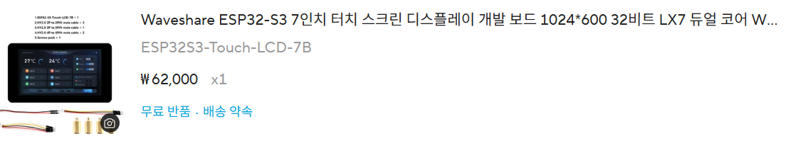

### Summary

- 소형 컴퓨터 대신 저전력 임베디드 시스템을 선택한 이유
- 7인치 Waveshare ESP32-S3 개발보드를 선택한 과정
- USB Host 검증 계획과 기본 LVGL 터치 데모 실행

---

### 서문

지난 글에서는 대체 대화기기에 필요한 기능과 초기 형태를 정리했다. 그러나 필요한 기능을 정하는 것과, 그 기능을 실제로 구현할 하드웨어를 고르는 것은 별개의 문제였다.

처음에는 비교적 익숙한 형태인 소형 컴퓨터를 중심으로 생각했다. 라즈베리파이 3B+ 계열이나 라떼판다처럼 운영체제를 실행할 수 있는 보드라면 화면과 키보드를 연결하고, 일반적인 컴퓨터 프로그램을 개발하듯 기능을 구현하기 쉬울 것 같았다.

하지만 이 기기는 책상 위에 고정해서 사용하는 컴퓨터가 아니었다. 외부나 휠체어에서도 사용할 수 있어야 했고, 보조배터리나 내장 배터리로 구동할 수 있어야 했다. 이런 사용 환경을 고려하자 성능보다 가격, 배터리 지속시간과 발열이 더 중요한 조건으로 보이기 시작했다.

결국 완전한 컴퓨터를 작게 만드는 방향보다 필요한 기능에 집중한 저전력 임베디드 기기를 만드는 방향으로 전환했다.

## 1. 소형 컴퓨터에서 임베디드 시스템으로

### 처음 검토한 후보

가장 먼저 생각한 것은 라즈베리파이와 라떼판다 같은 싱글보드 컴퓨터였다.

운영체제를 사용할 수 있기 때문에 일반적인 프로그램을 개발하듯 기능을 구현할 수 있고, USB 키보드나 디스플레이 같은 주변기기도 비교적 쉽게 연결할 수 있다는 장점이 있었다. 개발 초기에는 이런 자유도가 큰 장점처럼 보였다.

하지만 실제 사용 환경을 기준으로 생각해 보면 몇 가지 문제가 있었다.

첫 번째는 가격이었다. 보드 자체뿐만 아니라 디스플레이, 저장장치와 전원 관련 부품까지 추가하면 초기 프로토타입의 비용이 빠르게 증가할 수 있었다.

두 번째는 배터리 사용시간이었다. 이 기기는 콘센트 옆에서만 사용하는 장치가 아니라 외부나 휠체어에서도 사용할 수 있어야 했다. 높은 연산 성능보다 오랫동안 안정적으로 켜져 있는 것이 더 중요했다.

마지막은 발열이었다. 운영체제를 구동하는 소형 컴퓨터는 구조가 단순한 마이크로컨트롤러 기반 기기보다 전력 소비와 발열 관리에서 불리할 가능성이 컸다.

> **이 프로젝트에 필요한 것은 작은 컴퓨터가 아니라, 필요한 기능을 안정적으로 수행하는 전용 기기였다.**

이 판단을 기준으로 저전력 임베디드 보드를 다시 찾기 시작했다.

## 2. 다시 떠올린 ESP 계열

처음에는 아두이노 계열 보드를 중심으로 찾아보았다. 그러던 중 [고등학교 코업(The Hacksmith)](https://hongjunyun.github.io/work/hacksmith/) 과정에서 사용했던 ESP8266이 떠올랐다.

당시의 경험 덕분에 ESP 계열이 무선통신 기능을 갖춘 마이크로컨트롤러라는 점은 알고 있었다. 이후 제품을 찾아보면서 ESP32 계열이라면 화면 제어와 무선통신, 외부 장치 연결에 무난하게 사용할 수 있을 것이라고 판단했다.

프로토타입에 필요하다고 생각한 조건은 다음과 같았다.

1. 문장을 충분히 크게 표시할 수 있는 화면
2. 표준 USB HID 키보드나 수신기를 연결할 수 있는 USB Host 기능
3. 외부 모듈과 통신할 수 있는 인터페이스
4. 보호자용 기기와의 무선통신
5. 보조배터리 또는 내장 배터리를 통한 이동식 사용

I²C나 UART 같은 인터페이스가 있다면 추후 센서나 Zigbee 모듈 등 외부 장치를 추가할 수 있다고 보았다. Zigbee를 보드가 직접 지원해야 한다는 의미보다는, 필요할 경우 별도의 통신 모듈을 연결할 수 있는 확장성을 고려한 것이다.

보호자용 기기와의 통신 방식도 처음부터 확정되어 있지는 않았다. AWS와 같은 클라우드 서비스나 무료 호스팅을 사용하는 방법도 생각했지만, ESP32 계열을 선택하면서 ESP-NOW를 유력한 통신 방식으로 검토하게 되었다.

## 3. 화면 크기보다 먼저 본 것

처음부터 7인치로 화면 크기를 확정한 것은 아니었다. 10인치 화면도 후보로 검토했다.

중요했던 것은 특정한 화면 크기 자체가 아니라 화면이 지나치게 작지 않으면서도, 노안이 있는 사용자가 문장을 읽을 수 있는 가독성을 확보하는 것이었다. 동시에 외부에서 사용할 수 있을 정도의 크기와 전력 소비도 고려해야 했다.

결과적으로 7인치와 1024×600 해상도는 휴대성과 가독성 사이에서 현실적인 후보가 되었다.

화면에 많은 정보를 표시하는 것이 목표는 아니었다. 한 번에 하나의 문장이나 짧은 대화를 크고 명확하게 보여주는 것이 더 중요했다. 따라서 해상도 역시 정교한 그래픽보다는 큰 글자를 안정적으로 표시할 수 있는지를 기준으로 판단했다.

## 4. Waveshare ESP32-S3 보드 선택

AliExpress에서 조건에 맞는 제품을 찾던 중 Waveshare의 `ESP32-S3-Touch-LCD-7B`를 발견했다.

가격은 할인 적용 기준으로 약 5만 5천 원대였다.

이 제품을 선택한 이유는 단순히 7인치 화면이 장착되어 있었기 때문만은 아니었다. 프로그램을 업로드하는 포트와 외부 장치를 연결하는 USB 포트가 분리되어 있었고, 여러 개발용 인터페이스와 옵션이 제공되는 점이 인상적이었다.

당시 제품 설명에는 USB 지원이 명시되어 있었다. 하지만 그것이 USB 장치로 동작하는 Device 모드만 의미하는지, 키보드나 USB 수신기를 연결할 수 있는 Host 모드까지 의미하는지는 확신할 수 없었다.

제품 자료와 회로 관련 정보를 Gemini에 입력해 검토했을 때는 USB Host로 사용할 가능성이 높다는 답을 받았다. 다만 이것은 실제 동작을 확인한 결과가 아니라, 구매 전에 공개된 자료를 바탕으로 가능성을 판단한 것이었다.

따라서 당시의 결론은 다음에 가까웠다.

> **USB Host가 확실히 검증된 것은 아니지만, 하드웨어 구조상 가능성이 높고 나머지 조건도 충분히 만족하므로 프로토타입으로 시험해 볼 가치가 있다.**

프로토타입 단계에서는 모든 조건이 완전히 검증된 제품을 찾기보다, 핵심 기능을 실제로 시험할 수 있는 보드를 확보하는 것이 더 중요하다고 판단했다.

### 전용 키보드보다 먼저 검증할 것

이 프로젝트에서는 대체 대화기기와 함께 전용 키보드도 개발할 예정이다. 전용 키보드는 이 기기에서만 사용할 수 있는 독자적인 통신 방식이 아니라, 일반적인 컴퓨터에서도 인식할 수 있는 표준 USB HID 키보드로 설계하려고 했다.

다만 개발 중인 키보드와 대체 대화기기를 처음부터 함께 시험하면, 입력이 들어오지 않았을 때 어느 쪽에 문제가 있는지 구분하기 어렵다.

대체 대화기기의 USB Host 구현이 잘못된 것인지, 직접 만든 키보드의 USB HID 구현이 잘못된 것인지 바로 판단할 수 없기 때문이다.

따라서 초기 USB Host 시험에는 이미 정상 동작이 확인된 상용 입력장치를 사용하기로 했다. Waveshare 보드의 USB 포트에 USB-C Logi Bolt 수신기를 연결하고, 풀 배열 Logitech MX Keys S의 입력이 정상적으로 전달되는지 먼저 확인할 계획이다.

이 단계가 성공한 뒤 직접 개발한 USB HID 키보드로 교체한다.

> **먼저 검증된 입력장치로 호스트를 확인하고, 이후 직접 만든 입력장치를 연결한다.**

이렇게 시험 순서를 나누면 대체 대화기기와 키보드를 동시에 개발하면서도 문제의 원인을 한쪽씩 분리해 확인할 수 있다.

## 5. 제품 수령과 첫 실행

제품을 받아 본 뒤에는 예상보다 개발용 옵션이 많다는 점이 가장 먼저 눈에 들어왔다. 단순히 화면과 ESP32-S3를 연결한 제품이라기보다, 여러 인터페이스와 표준적인 연결 방식을 고려해 만든 개발보드라는 인상을 받았다.

또한 제조사에서 공식 위키를 제공하고 있었고, 보드를 처음 실행하기 위한 예제와 설명도 비교적 잘 정리되어 있었다.

Mac에서 제조사가 제공한 기본 데모를 올려 보았다. 데모는 여러 탭으로 나뉜 LVGL 시연 화면이었으며, 화면 출력과 터치 입력을 확인할 수 있었다.

별도의 기능을 직접 구현한 것은 아니었지만, 이 단계에서 다음 두 가지는 확인할 수 있었다.

1. 보드와 디스플레이가 정상적으로 동작한다.
2. 터치 기반 인터페이스를 구성할 수 있다.

처음 예상했던 것보다 공식 소프트웨어 지원도 잘 준비되어 있었다. 아직 USB HID 입력이나 보호자용 기기와의 통신을 구현한 것은 아니었지만, 최소한 화면과 터치를 기반으로 개발을 시작할 수 있는 환경은 확보한 셈이었다.

## 6. SD카드를 함께 준비한 이유

보드를 준비하면서 SD카드도 함께 마련했다.

한글 폰트는 영문이나 숫자만 포함한 폰트보다 많은 글리프를 필요로 한다. 당시에는 필요한 한글 폰트를 보드의 내부 플래시 메모리에 모두 포함하면 용량 부담이 커질 수 있다고 예상했다.

따라서 폰트 파일을 SD카드에 저장하고 필요할 때 불러오는 구조를 염두에 두고 SD카드도 함께 준비했다.

기본 데모를 실행하는 단계에서는 한글 지원 여부가 바로 문제가 되지는 않았다. 문제는 이후 직접 화면에 `안녕하세요`를 출력하려고 했을 때 드러났다.

기본 환경에는 한글 글리프가 포함된 폰트가 준비되어 있지 않았고, 영문이나 숫자를 출력하는 것처럼 바로 한글을 표시할 수는 없었다.

하드웨어를 선택하고 기본 데모를 실행하는 단계는 비교적 순조로웠지만, 실제 대체 대화기기로 만들기 위해서는 한글 폰트와 입력 처리라는 별도의 소프트웨어 문제가 남아 있었다.

---

이번 글에서는 소형 컴퓨터 대신 저전력 임베디드 시스템을 선택한 이유와, 첫 프로토타입 보드를 구매해 기본 데모를 실행한 과정까지 정리했다.

다음 글부터는 이 보드 위에서 실제로 한글을 표시하고, USB HID 키보드의 입력을 받아 문장으로 조합하기 위한 소프트웨어 개발 과정을 다룰 예정이다.